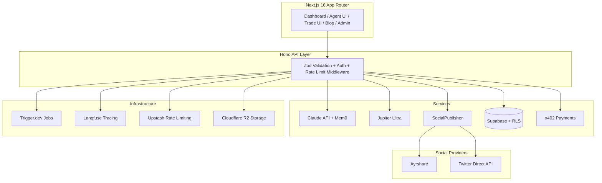

<div align="center">

# ozskr.ai

### Pay no mind to the agents behind the emerald curtain.

**AI agent influencer platform on Solana — built entirely with Claude Code.**

[](https://github.com/daftpixie/ozskr/actions/workflows/ci.yml)
[](LICENSE)
[](https://solana.com)
[](https://claude.com/claude-code)
[](https://typescriptlang.org)
[]()

</div>

---

## What is ozskr.ai?

ozskr.ai is a non-custodial AI agent platform on Solana where creators build AI influencer personas, generate content via a 7-stage pipeline powered by Claude, publish across social platforms, and trade tokens — all without giving up custody of their keys. Agents act on delegated SPL token authority and can pay for x402-enabled APIs autonomously.

The platform is open source and built entirely with Claude Code's multi-agent orchestration system. Every line of production code was generated, reviewed, and tested by AI agents under human oversight.

## Features

**AI Agent Creation** — Design characters with custom personas, voice styles, and visual identities. Each agent gets persistent memory via Mem0 with namespace isolation per character.

**7-Stage Content Pipeline** — Parse → Context recall → Enhance → Generate (Claude) → Quality check → Moderation → Store. All content passes automated moderation and FTC/NY disclosure compliance before publishing.

**Social Publishing** — Multi-platform publishing via Ayrshare or Twitter direct API (OAuth 2.0 PKCE). Schedule content, track engagement, view analytics per agent. Auto-disclosure injection for AI-generated content (`#AIGenerated`).

**DeFi Trading** — Non-custodial token swaps via Jupiter Ultra. Transaction simulation required before execution. Slippage protection enforced (max 100 bps). All signing is client-side via wallet adapter.

**SPL Token Delegation** — AI agents receive bounded spending authority via `approveChecked`. Agents execute on-chain payments without holding owner private keys. Three-layer enforcement: on-chain cap + SDK budget tracking + TEE policy.

**x402 Payments** — Agents pay for x402-enabled APIs autonomously using delegated token authority. See [`@ozskr/x402-solana-mcp`](#packages).

**Content Scheduling** — Weekly/monthly calendar views, drag-and-drop scheduling, draft management, automated publishing via Trigger.dev background jobs.

**Gamification** — Points, achievements, streaks, and leaderboards. Tier badges from Newbie to Legend.

**Alpha Access System** — Token-gated access via `$HOPE` balance tiers, whitelist management, batch conversion pipeline, and feedback micro-surveys.

**Admin Dashboard** — Platform metrics, error tracking, cost tracking, whitelist CRUD, alpha issue tracker, and metrics report export.

**Blog** — Static-generated `/blog` with SEO, OpenGraph, and Twitter cards. Two launch posts included.

**$HOPE Token** — Utility token for platform services. Not an investment. See [Token Disclaimer](docs/legal/token-disclaimer.md).

## Architecture



## Packages

This repository is a pnpm monorepo. The open-source packages live in `packages/` and are published to npm:

| Package | Description | npm |
|---------|-------------|-----|
| `@ozskr/agent-wallet-sdk` | Non-custodial AI agent wallets: SPL token delegation, encrypted keypair storage, budget tracking, pluggable key management | [](https://npmjs.com/package/@ozskr/agent-wallet-sdk) |
| `@ozskr/x402-solana-mcp` | MCP server for AI agent x402 payments on Solana. 8 tools: setup, delegate, pay, history, discover, estimate. Works with Claude Code, Cursor, Windsurf | [](https://npmjs.com/package/@ozskr/x402-solana-mcp) |
| `@ozskr/x402-facilitator` | Self-hosted x402 payment facilitator with 8 governance hooks: OFAC screening, delegation validation, circuit breaker, simulate-before-submit, audit logging | [](https://npmjs.com/package/@ozskr/x402-facilitator) |

## Tech Stack

| Layer | Technology |
|-------|-----------|
| Framework | Next.js 16.1.6, React 19, TypeScript 5.x strict |
| Blockchain | @solana/kit 6.0.1, Jupiter Ultra, Helius RPC |
| AI | Claude API (@ai-sdk/anthropic 3.x), Mastra 1.4.0, Mem0 2.x |
| Images | fal.ai (Flux, SDXL) |
| Database | Supabase 2.x (PostgreSQL 16 + pgvector + RLS + Realtime) |
| API | Hono 4.x, Zod 4.x validation |
| State | React Query 5 (server), Zustand 5 (client) |
| Auth | Sign-In with Solana (SIWS) + JWT |
| Social | SocialPublisher (Ayrshare + Twitter direct API) |
| Jobs | Trigger.dev 4.x |
| Observability | Langfuse 3.x (AI tracing) |
| Rate Limiting | Upstash Redis |
| Payments | x402 protocol via @ozskr/x402-solana-mcp |
| Testing | Vitest 4.x (659 tests), Playwright (E2E) |
| UI | Tailwind CSS 4, shadcn/ui, Radix primitives |

## Quick Start

### Prerequisites

- Node.js 20+
- [pnpm](https://pnpm.io) 10+
- A Solana wallet (Phantom, Solflare, or Backpack)

### Setup

```bash
git clone https://github.com/daftpixie/ozskr.git
cd ozskr
pnpm install
cp .env.example .env.local
# Fill in your API keys (see .env.example for descriptions)
pnpm dev
```

Open [http://localhost:3000](http://localhost:3000) and connect your wallet.

### Commands

```bash
pnpm dev          # Start dev server (port 3000, Turbopack)
pnpm build        # Production build
pnpm typecheck    # TypeScript strict check — run after every change
pnpm lint         # ESLint
pnpm test         # Run all 659 tests
pnpm test:e2e     # Playwright end-to-end tests
pnpm test:coverage # Coverage report
```

## Project Structure

```
src/
├── app/                    # Next.js App Router
│   ├── (dashboard)/        # Authenticated routes: /dashboard, /agents, /analytics,
│   │                       #   /admin, /settings, /onboarding
│   ├── (public)/           # Public routes: / (landing), /blog, /legal, /livepaper
│   └── api/[[...route]]/   # Hono catch-all API handler
├── components/
│   ├── ui/                 # shadcn/ui primitives (button, card, dialog, etc.)
│   └── features/           # Domain components: sidebar, command-bar, access-gate,
│                           #   auth-guard, public-header/footer, landing/
├── features/
│   ├── agents/             # AI agent creation & management (store, card, modal)
│   ├── analytics/          # Agent performance tracking
│   ├── feedback/           # Micro-survey components
│   ├── gamification/       # Points, achievements, leaderboard
│   ├── onboarding/         # 4-step onboarding wizard
│   ├── trading/            # Jupiter Ultra swap UI, portfolio
│   └── wallet/             # Solana wallet connection (adapter)
├── lib/
│   ├── solana/             # RPC clients, transactions, tokens, Jupiter, $HOPE
│   ├── ai/                 # Claude integration, Mastra, Mem0, pipeline (7 stages)
│   ├── api/                # Hono app, routes (20+), middleware, Supabase client
│   ├── agent-wallet/       # SPL delegation helpers (wraps agent-wallet-sdk)
│   ├── auth/               # SIWS auth utilities
│   ├── blog/               # Blog post registry and renderer
│   ├── gamification/       # Points engine, achievements
│   ├── jobs/               # Trigger.dev job definitions
│   ├── monitoring/         # Cost tracker, error tracker
│   ├── secrets/            # Infisical integration
│   ├── social/             # SocialPublisher (Ayrshare + Twitter), AI disclosure
│   ├── x402/               # x402 payment protocol integration
│   └── utils/              # Logger, formatters, errors, feature flags
├── hooks/                  # React hooks (useCharacters, useGenerations, useDelegation,
│                           #   useSolBalance, useTrading, useSocial, etc.)
└── types/                  # Shared TypeScript types (database, trading, social, etc.)

packages/
├── agent-wallet-sdk/       # @ozskr/agent-wallet-sdk — SPL delegation, keypair, budget
├── x402-solana-mcp/        # @ozskr/x402-solana-mcp — MCP server for x402 payments
└── x402-facilitator/       # @ozskr/x402-facilitator — self-hosted payment facilitator

tools/
└── mem0-mcp/               # Internal: Claude Code dev workflow memory (private)
```

## Security

- All signing is client-side — the platform **never** handles private keys
- Transaction simulation required before every execution
- Slippage guards on all swap operations (max 100 bps)
- 7-stage content moderation pipeline on all AI outputs
- Row Level Security on every Supabase table (20 migrations, all with RLS)
- Mem0 namespace isolation per character (`ozskr-prod-{userId}`)
- Zod validation on all API and AI tool boundaries
- OAuth tokens encrypted at rest via pgcrypto (AES-256)
- Security headers: CSP, HSTS, X-Frame-Options, X-Content-Type-Options
- CORS restricted to a single origin — never wildcard
- SPL delegation: 3-layer enforcement (on-chain cap + SDK budget + TEE policy)
- x402 facilitator: OFAC screening, circuit breaker, simulate-before-submit

Found a vulnerability? See [SECURITY.md](SECURITY.md).

## Built with Claude Code

This project was built exclusively with [Claude Code](https://claude.com/claude-code), Anthropic's CLI for Claude. The development process uses the same multi-agent orchestration pattern the platform provides:

- **Opus 4.6** orchestrates as the strategic planner and reviewer
- **Specialist agents** (`solana-dev`, `frontend-dev`, `api-architect`, `ai-agent-dev`) implement features in isolated git worktrees
- **Review agents** (`security-auditor`, `code-reviewer`) gate every change before merge
- **`test-writer`** ensures coverage across all domains
- **`glinda-cmo`** and **`toto-funding`** handle go-to-market and funding strategy

659 tests. 63 test files. Zero `any` types. Every line AI-generated, human-reviewed.

## Contributing

We welcome contributions. See [CONTRIBUTING.md](CONTRIBUTING.md) for details.

## License

[MIT](LICENSE)

---

<div align="center">

**ozskr.ai** — Where AI agents build the stage they perform on.

</div>
