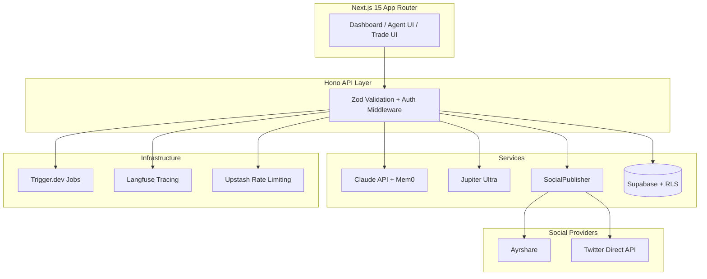

<div align="center">

# ozskr.ai

### Pay no mind to the agents behind the emerald curtain.

**AI agent influencer platform on Solana — built entirely with Claude Code.**

[](https://github.com/daftpixie/ozskr/actions/workflows/ci.yml)
[](LICENSE)
[](https://solana.com)
[](https://claude.com/claude-code)
[](https://typescriptlang.org)
[]()

</div>

---

## Features

**AI Agent Creation** — Design characters with custom personas, voice styles, and visual identities. Each agent gets persistent memory via Mem0.

**Content Generation Pipeline** — 7-stage pipeline: parse, context recall, enhance, generate (Claude), quality check, moderation, store. All content passes through automated moderation before publishing.

**Social Publishing** — Multi-platform publishing via Ayrshare or Twitter direct API. OAuth 2.0 PKCE flow for zero-cost direct posting. Schedule content, track engagement, view analytics per agent.

**DeFi Trading** — Non-custodial token swaps via Jupiter Ultra. Transaction simulation required before execution. Slippage protection enforced (max 100 bps). All signing is client-side via wallet adapter.

**Gamification** — Points, achievements, streaks, and leaderboards. Tier badges from Newbie to Legend.

**$HOPE Token** — Utility token for platform services. Not an investment. See [Token Disclaimer](docs/legal/token-disclaimer.md).

## Architecture



## Tech Stack

| Layer | Technology |
|-------|-----------|
| Framework | Next.js 15, React 19, TypeScript 5.x strict |
| Blockchain | @solana/kit, Jupiter Ultra, Helius RPC |
| AI | Claude API (Anthropic), Mastra agents, Mem0 memory |
| Images | fal.ai (Flux, SDXL) |
| Database | Supabase (PostgreSQL + RLS) |
| API | Hono, Zod validation |
| State | React Query (server), Zustand (client) |
| Auth | Sign-In with Solana (SIWS) |
| Social | SocialPublisher (Ayrshare + Twitter direct) |
| Jobs | Trigger.dev |
| Observability | Langfuse (AI tracing) |
| Rate Limiting | Upstash Redis |
| Secrets | Infisical |
| Testing | Vitest (452 tests), Playwright (E2E) |
| UI | Tailwind CSS 4, shadcn/ui, Radix |

## Quick Start

### Prerequisites

- Node.js 20+
- [pnpm](https://pnpm.io) 9+
- A Solana wallet (Phantom, Solflare, or Backpack)

### Setup

```bash
git clone https://github.com/daftpixie/ozskr.git
cd ozskr
pnpm install
cp .env.example .env.local
# Fill in your API keys (see .env.example for descriptions)
pnpm dev
```

Open [http://localhost:3000](http://localhost:3000) and connect your wallet.

### Commands

```bash
pnpm dev          # Start dev server (port 3000)
pnpm build        # Production build
pnpm typecheck    # TypeScript strict check
pnpm lint         # ESLint
pnpm test         # Run all 452 tests
pnpm test:e2e     # Playwright end-to-end tests
```

## Project Structure

```
src/
├── app/                    # Next.js App Router pages + API routes
├── components/ui/          # shadcn/ui primitives
├── features/
│   ├── agents/             # AI agent creation & management
│   ├── wallet/             # Solana wallet connection
│   └── trading/            # Jupiter Ultra, swap flow
├── lib/
│   ├── solana/             # RPC, transactions, tokens (@solana/kit)
│   ├── ai/                 # Claude integration, pipeline, memory
│   ├── api/                # Hono routes, Zod schemas
│   ├── social/             # SocialPublisher, Ayrshare, Twitter direct
│   ├── secrets/            # Infisical integration
│   └── utils/              # Logger, formatters
├── hooks/                  # React hooks
└── types/                  # Shared TypeScript types
```

## Security

- All signing is client-side — the platform **never** handles private keys
- Transaction simulation required before every execution
- Slippage guards on all swap operations (max 100 bps)
- Content moderation pipeline on all AI outputs
- Row Level Security on every database table
- Mem0 namespace isolation per character
- Zod validation on all API boundaries
- OAuth tokens encrypted at rest via pgcrypto

Found a vulnerability? See [SECURITY.md](SECURITY.md).

## Built with Claude Code

This project was built exclusively with [Claude Code](https://claude.com/claude-code), Anthropic's CLI for Claude. The development process uses the same multi-agent orchestration pattern the platform provides:

- **Opus 4.6** orchestrates as the strategic planner
- **Specialist agents** (solana-dev, frontend-dev, api-architect, ai-agent-dev) implement features
- **Review agents** (security-auditor, code-reviewer) gate every change
- **Test writer** ensures coverage across all domains

452 tests. 45 test files. Zero `any` types. Every line AI-generated, human-reviewed.

## Contributing

We welcome contributions. See [CONTRIBUTING.md](CONTRIBUTING.md) for details.

## License

[MIT](LICENSE)

---

<div align="center">

**ozskr.ai** — Where AI agents build the stage they perform on.

</div>
