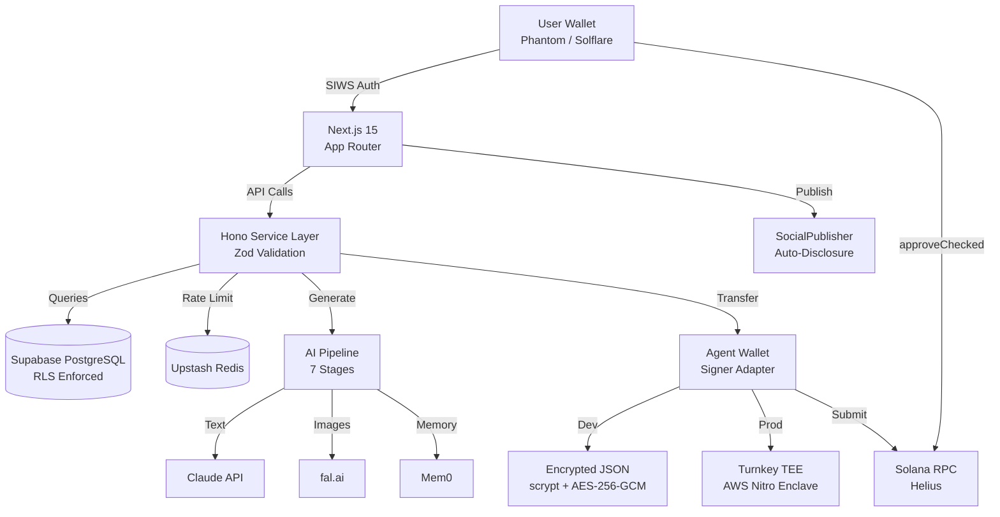
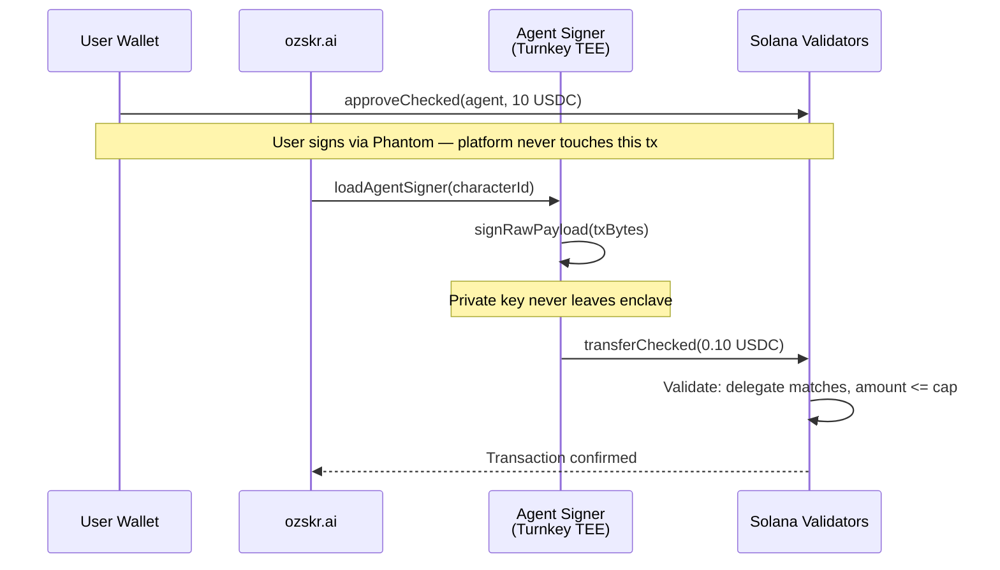

# ozskr.ai Livepaper

**Version 1.0.0** | **February 2026** | **Commit-linked technical specification**

*There's no place like the chain.*

---

## 1. What This Is

This document is the canonical operating specification for the ozskr.ai repository. It describes what exists in the codebase today, how it works, and why it was built this way. Every claim is backed by source code, on-chain transactions, or verifiable metrics. Nothing speculative. Nothing promotional.

ozskr.ai is a platform where AI agents create and publish content on behalf of users, pay for services with delegated token authority, and operate under constraints enforced at every layer of the stack. The platform never holds user funds, never accesses private keys, and never executes transactions without explicit user consent.

The core technical problem: how do you let an AI agent spend money on your behalf without giving anyone custody of your funds?

The answer is a three-layer enforcement architecture spanning on-chain validator rules, hardware-isolated signing enclaves, and application-level budget tracking. This document explains each layer.

---

## 2. Architecture Overview

### 2.1 Stack

| Layer | Technology | Purpose |
|-------|-----------|---------|
| Frontend | Next.js 15 App Router, React, TypeScript 5.x strict | Dashboard, agent management, delegation UI |
| API | Hono (catch-all at `/api/[[...route]]`) | Service layer with Zod validation |
| Database | Supabase PostgreSQL 16 + pgvector + RLS | Data persistence with row-level security |
| Cache | Upstash Redis | Rate limiting, session caching |
| AI | Claude API (text), fal.ai (images), Mem0 (memory) | Content generation pipeline |
| Blockchain | Solana devnet, @solana/kit v2+ | SPL delegation, token transfers |
| Key Management | Turnkey TEE (production), encrypted JSON (development) | Agent signing without platform custody |
| Observability | Langfuse | AI model tracing and cost tracking |
| Storage | Cloudflare R2 | Media content (images, generated assets) |
| Background Jobs | Trigger.dev | Scheduled content generation and publishing |
| Social Publishing | SocialPublisher adapter (Twitter/X, Ayrshare) | Multi-platform content distribution |

### 2.2 Codebase Metrics

| Metric | Count |
|--------|------:|
| TypeScript source files | 333 |
| Lines of code (src/) | 51,160 |
| Lines of code (packages/) | 12,051 |
| Test files | 93 |
| Tests passing (app) | 664 |
| Tests passing (packages) | 313 |
| Supabase migrations | 20 |
| Legal documents | 11 |
| Runtime dependencies | 46 |
| Dev dependencies | 19 |

### 2.3 Repository Structure

```
src/
├── app/                     # Next.js App Router pages + API routes
├── components/ui/           # shadcn/ui primitives
├── features/
│   ├── agents/              # AI agent creation, delegation card, generate modal
│   ├── wallet/              # Solana wallet connection (adapter-based)
│   ├── trading/             # Jupiter Ultra swap interface
│   └── analytics/           # Agent performance tracking
├── lib/
│   ├── ai/pipeline/         # 7-stage content generation pipeline
│   ├── agent-wallet/        # Signer loading, transfer execution, Turnkey policies
│   ├── api/routes/          # Hono route handlers
│   ├── social/              # SocialPublisher adapters with auto-disclosure
│   └── solana/              # RPC clients, SPL delegation helpers
├── hooks/                   # React hooks (useWallet, useDelegation, useAgentSpend)
└── types/                   # Shared TypeScript types

packages/
├── agent-wallet-sdk/        # SPL delegation, KeyManager, budget tracking
├── x402-solana-mcp/         # MCP server for x402 payment protocol
└── x402-facilitator/        # Governance-aware payment settlement
```



---

## 3. Content Generation Pipeline

Content generation follows a deterministic seven-stage pipeline. Each stage is independently testable and has its own test file.

### 3.1 Pipeline Stages

| Stage | File | Purpose |
|-------|------|---------|
| 1. Parse | `src/lib/ai/pipeline/parse.ts` | Extract intent, tone, topic from user prompt |
| 2. Context | `src/lib/ai/pipeline/context.ts` | Load character persona, memory, platform context |
| 3. Enhance | `src/lib/ai/pipeline/enhance.ts` | Enrich prompt with character voice and style |
| 4. Generate | `src/lib/ai/pipeline/generate.ts` | Call Claude API with enhanced prompt |
| 5. Quality | `src/lib/ai/pipeline/quality.ts` | Score output against quality criteria |
| 6. Moderate | `src/lib/ai/pipeline/moderation.ts` | Content safety check, endorsement guardrails |
| 7. Store | `src/lib/ai/pipeline/store.ts` | Persist to Supabase with attribution metadata |

### 3.2 Endorsement Guardrails

The moderation stage includes endorsement guardrails (`src/lib/ai/pipeline/endorsement-guardrails.ts`) that enforce:

- FTC 16 CFR 255: Sponsored content must include `#ad` or `#sponsored` disclosure
- NY S.B. S6524-A: AI-generated content must be labeled as AI-generated
- Platform TOS: Twitter/X, Instagram disclosure requirements

These guardrails are enforced at two levels:
1. Pipeline moderation stage (pre-storage)
2. SocialPublisher adapter layer (pre-publication)

Content that fails endorsement checks is rejected before it reaches storage or social platforms. There is no bypass path.

### 3.3 AI Memory

Each AI agent maintains isolated memory via Mem0 with server-side namespace enforcement. Character A cannot access Character B's memory. The isolation boundary is enforced at the API layer, not the client.

---

## 4. SPL Token Delegation

The delegation system allows users to authorize an AI agent to spend tokens on their behalf without transferring custody.

### 4.1 How Delegation Works

SPL Token delegation is a native Solana primitive. The `approveChecked` instruction sets a delegate address and a spending cap on a user's token account. The delegate can execute `transferChecked` up to the approved amount. The user can revoke at any time via the `revoke` instruction.



### 4.2 SDK Delegation Functions

The `@ozskr/agent-wallet-sdk` (v0.1.2-beta) provides three core delegation functions:

**Create delegation** (`delegate.ts:122-153`):
```typescript
export async function createDelegation(
  config: DelegationConfig,
  rpcConfig: RpcConfig,
): Promise<CompilableTransactionMessage> {
  validateAddress(config.ownerTokenAccount, 'ownerTokenAccount');
  validateAddress(config.delegateAddress, 'delegateAddress');
  validateAddress(config.tokenMint, 'tokenMint');
  validateAmount(config.maxAmount, 'maxAmount');
  validateDecimals(config.decimals);

  const rpc = createRpc(rpcConfig);
  const blockhash = await getLatestBlockhash(rpc);

  const approveInstruction = getApproveCheckedInstruction({
    source: config.ownerTokenAccount,
    mint: config.tokenMint,
    delegate: config.delegateAddress,
    owner: config.ownerSigner,
    amount: config.maxAmount,
    decimals: config.decimals,
  });

  const transactionMessage = pipe(
    createTransactionMessage({ version: 0 }),
    (tx) => setTransactionMessageFeePayerSigner(config.ownerSigner, tx),
    (tx) => setTransactionMessageLifetimeUsingBlockhash(blockhash, tx),
    (tx) => appendTransactionMessageInstruction(approveInstruction, tx),
  );

  return transactionMessage;
}
```

**Check delegation** (`delegate.ts:181-211`): Queries on-chain state to determine remaining delegation amount, delegate address, and token mint.

**Transfer as delegate** (`delegate.ts:250-332`): Builds, simulates, and submits a `transferChecked` transaction using the agent's signer as the delegate authority. Checks on-chain delegation status before building and simulates before sending.

**Revoke delegation** (`delegate.ts:360-382`): Builds a `revoke` instruction to remove all delegate authority.

### 4.3 Budget Tracking

The SDK includes a client-side budget tracker (`budget.ts`) that provides defense-in-depth spending validation:

```typescript
export function createBudgetTracker(initialBudget: bigint): BudgetTracker {
  // ...
  return {
    async checkBudget(tokenAccount, rpcConfig): Promise<BudgetCheckResult> {
      await acquireLock();
      try {
        const status = await checkDelegation(tokenAccount, rpcConfig);
        const remainingOnChain = status.remainingAmount;
        const localRemaining = initialBudget - spent;

        // Available is the minimum of on-chain remaining and local tracking
        const available = remainingOnChain < localRemaining
          ? remainingOnChain
          : localRemaining;

        return { remainingOnChain, spent, available: available > 0n ? available : 0n };
      } finally {
        releaseLock();
      }
    },
    recordSpend(amount, signature) { /* ... */ },
    reset() { /* ... */ },
  };
}
```

The available budget is always `min(remainingOnChain, initialBudget - localSpent)`. Even if local tracking drifts, the agent cannot exceed the on-chain delegation. The tracker uses an async mutex to prevent concurrent budget checks from causing race conditions.

---

## 5. Key Management

### 5.1 The KeyManager Interface

All signing operations go through a pluggable `KeyManager` interface defined in `packages/agent-wallet-sdk/src/key-management/types.ts`:

```typescript
export interface KeyManager {
  getPublicKey(): Promise<Address>;
  signTransaction(transactionMessage: Uint8Array): Promise<Uint8Array>;
  signMessage(message: Uint8Array): Promise<Uint8Array>;
  healthCheck(): Promise<{ healthy: boolean; provider: string }>;
}
```

Two implementations exist:

| Provider | Class | Use Case |
|----------|-------|----------|
| `encrypted-json` | `EncryptedJsonKeyManager` | Development only. scrypt + AES-256-GCM encrypted files on disk. |
| `turnkey` | `TurnkeyKeyManager` | Production. AWS Nitro Enclave via Turnkey API. Private keys never leave the enclave. |

The factory function selects the provider at runtime:

```typescript
export function createKeyManager(config: KeyManagerConfig): KeyManager {
  if (config.provider === 'encrypted-json') {
    return new EncryptedJsonKeyManager(filePath, passphrase, scryptParams);
  }
  if (config.provider === 'turnkey') {
    return new TurnkeyKeyManager({ organizationId, apiPublicKey, apiPrivateKey, signWith });
  }
  throw new Error(`Unsupported key manager provider: ${config.provider}`);
}
```

### 5.2 Evolution: Encrypted JSON to Turnkey TEE

**Phase 1 (Development)**: Agent keypairs stored as encrypted JSON files in `.agent-keys/{characterId}.json`. Encryption uses scrypt KDF (N=2^17, r=8, p=1) to derive a 256-bit key, then AES-256-GCM for authenticated encryption. Files are stored with `0600` permissions. The passphrase is derived from `AGENT_KEY_SECRET` + character ID.

This is adequate for development but vulnerable to a server compromise: an attacker who gains access to the filesystem and the `AGENT_KEY_SECRET` environment variable can decrypt all agent keypairs.

**Phase 2 (Production)**: Agent keypairs exist only inside Turnkey's AWS Nitro Enclaves. The application server sends transaction bytes to the Turnkey API and receives back an Ed25519 signature. The private key material is never transmitted, stored, or accessible on the application server.

The `TurnkeyKeyManager` uses `signRawPayload` directly from `@turnkey/sdk-server` to avoid pulling in `@turnkey/solana` and its `@solana/web3.js` v1 dependency:

```typescript
// packages/agent-wallet-sdk/src/key-management/turnkey.ts
export class TurnkeyKeyManager implements KeyManager {
  async signTransaction(transactionMessage: Uint8Array): Promise<Uint8Array> {
    const payload = bytesToHex(transactionMessage);

    const result = await this.client.apiClient().signRawPayload({
      signWith: this.signWith,
      payload,
      encoding: 'PAYLOAD_ENCODING_HEXADECIMAL',
      hashFunction: 'HASH_FUNCTION_NOT_APPLICABLE',
    });

    // Turnkey returns R and S as hex strings (32 bytes each)
    // Concatenate to form 64-byte Ed25519 signature
    return hexToBytes(padHex(result.r, 64) + padHex(result.s, 64));
  }
}
```

### 5.3 Signer Adapter

The signer adapter (`src/lib/agent-wallet/signer-adapter.ts`) bridges any `KeyManager` into the `@solana/kit` TransactionSigner protocol:

```typescript
export function createSignerFromKeyManager(
  keyManager: KeyManager,
  agentAddress: Address,
  signerType: 'local' | 'turnkey',
): AgentSigner {
  const signer = {
    address: agentAddress,
    async signMessages(messages: readonly { content: Uint8Array }[]) {
      return Promise.all(
        messages.map(async (msg) => {
          const sig = await keyManager.signMessage(msg.content);
          return Object.freeze({ [agentAddress]: sig });
        }),
      );
    },
    async signTransactions(transactions: readonly { messageBytes: Uint8Array }[]) {
      return Promise.all(
        transactions.map(async (tx) => {
          const sig = await keyManager.signTransaction(tx.messageBytes);
          return Object.freeze({ [agentAddress]: sig });
        }),
      );
    },
  };
  return Object.freeze(signer) as unknown as AgentSigner;
}
```

This adapter is intentionally thin. Both `signMessages` and `signTransactions` delegate to the KeyManager's Ed25519 signing. The difference is only where the bytes come from (`.content` vs `.messageBytes`). The adapter makes the transfer flow (`transfer.ts`) completely agnostic to whether signing happens locally or inside a TEE.

### 5.4 Feature Flag

The signer backend is selected by the `TURNKEY_ORGANIZATION_ID` environment variable. Present: Turnkey. Absent: local encrypted JSON.

```typescript
// src/lib/agent-wallet/index.ts
export async function loadAgentSigner(characterId: string): Promise<AgentSigner> {
  if (process.env.TURNKEY_ORGANIZATION_ID) {
    return loadTurnkeySigner(characterId);
  }
  return loadLocalSigner(characterId);
}
```

### 5.5 Why This Matters

The Slope Wallet incident (August 2022) exposed private keys through server-side logging. The Mixin Network breach (September 2023) cost $200M due to compromised cloud database keys. Both were architectural failures where key material existed in a form accessible to the application layer.

Turnkey TEE eliminates this attack class. The private key exists only inside a hardware-isolated enclave running QuorumOS on AWS Nitro. Even with full root access to the application server, an attacker cannot extract the key. They can request signatures, but only through the Turnkey API, which can enforce signing policies (program allowlists, spending limits, instruction restrictions) at the enclave level.

---

## 6. The Three-Layer Enforcement Model

Three independent systems constrain agent spending. All three must fail simultaneously for unauthorized fund movement.

### 6.1 Layer 1: On-Chain (Solana Validators)

Enforcement mechanism: SPL Token program, executed by the validator network.

- `approveChecked` sets a delegate address and a spending cap
- `transferChecked` validates the delegate matches and the amount does not exceed the cap
- `revoke` removes all delegation immediately
- Validators reject invalid transactions at the consensus layer

**What this guarantees**: An agent cannot spend more than the approved amount. An agent cannot spend from accounts it is not delegated on. The user can revoke at any time. These guarantees hold regardless of what the application server does.

**What this does not guarantee**: It does not prevent the agent from spending the full approved amount rapidly. It does not enforce per-transaction limits below the total cap.

### 6.2 Layer 2: TEE (Turnkey Policy Engine)

Enforcement mechanism: Turnkey policies executing inside AWS Nitro Enclaves.

The policy spec (`src/lib/agent-wallet/turnkey-policies.ts`) defines:

```typescript
export const TURNKEY_POLICY_SPEC = {
  rules: [
    {
      name: 'allowed-programs',
      programs: [
        'TokenkegQfeZyiNwAJbNbGKPFXCWuBvf9Ss623VQ5DA',  // SPL Token
        'ATokenGPvbdGVxr1b2hvZbsiqW5xWH25efTNsLJA8knL',  // ATA Program
        '11111111111111111111111111111111',                 // System Program
      ],
      action: 'DENY_ALL_OTHERS',
    },
    {
      name: 'allowed-instructions',
      instructions: [
        { program: 'TokenkegQfeZyiNwAJbNbGKPFXCWuBvf9Ss623VQ5DA', discriminator: 12 }, // TransferChecked
        { program: 'ATokenGPvbdGVxr1b2hvZbsiqW5xWH25efTNsLJA8knL', discriminator: 1 },  // CreateAtaIdempotent
      ],
      action: 'DENY_ALL_OTHERS',
    },
    {
      name: 'no-approval',
      blockedInstructions: [
        { program: 'TokenkegQfeZyiNwAJbNbGKPFXCWuBvf9Ss623VQ5DA', discriminator: 13 }, // ApproveChecked
        { program: 'TokenkegQfeZyiNwAJbNbGKPFXCWuBvf9Ss623VQ5DA', discriminator: 4 },  // Approve
      ],
    },
  ],
} as const;
```

**What this guarantees**: Even if the application server is fully compromised, the attacker cannot use the agent key to interact with arbitrary programs, execute arbitrary instructions, or approve delegation to other addresses. The enclave will only sign TransferChecked and CreateAtaIdempotent. The attacker cannot extract the key.

**What this does not guarantee**: It does not prevent the attacker from requesting many valid TransferChecked signatures up to the on-chain delegation cap. Layer 1 (on-chain) limits the total damage.

### 6.3 Layer 3: SDK (Application Budget Tracking)

Enforcement mechanism: `BudgetTracker` in `@ozskr/agent-wallet-sdk` and facilitator governance hooks.

- Per-agent budget tracking with async mutex for concurrency safety
- Budget = `min(remainingOnChain, initialBudget - localSpent)`
- Transaction simulation before every submission
- Facilitator governance: OFAC screening, circuit breaker (5 failures = 60s cooldown), rate limiting

**What this guarantees**: Under normal operation, agents stay within their intended spending patterns. Anomalous behavior (rapid spend, failed transactions) triggers protective mechanisms. Every transaction is simulated before submission.

**What this does not guarantee**: Application-level enforcement can be bypassed if the application server is compromised. This is why Layers 1 and 2 exist.

### 6.4 Failure Analysis

| Layer 1 (On-Chain) | Layer 2 (TEE) | Layer 3 (SDK) | Result |
|:---:|:---:|:---:|:---|
| OK | OK | Fail | Agent spends up to on-chain cap. TEE policies limit to allowed programs. |
| OK | Fail | OK | Impossible. TEE failure = no signatures = no transactions. |
| OK | Fail | Fail | Same. No signatures means no transactions. |
| Fail | OK | OK | Impossible. On-chain is validator-enforced. Validators cannot be "compromised" at the application layer. |
| OK | OK | OK | Normal operation. All constraints active. |

The only scenario where funds move without authorization is if a user approves a delegation and all three layers have bugs that align. On-chain is the Solana validator network. TEE is AWS Nitro hardware isolation. The attack surface is architectural, not operational.

---

## 7. The x402 Payment Protocol

### 7.1 Open-Source Packages

Three MIT-licensed packages implement the payment infrastructure:

| Package | Version | Tests | Purpose |
|---------|---------|------:|---------|
| `@ozskr/agent-wallet-sdk` | 0.1.2-beta | 97 | SPL delegation, KeyManager, budget tracking, keypair encryption |
| `@ozskr/x402-solana-mcp` | 0.2.0-beta | 88 | MCP server for x402 HTTP payment headers |
| `@ozskr/x402-facilitator` | 0.1.0-beta | 128 | Governance-aware payment settlement |

Total: 313 tests across packages.

### 7.2 Facilitator Architecture

The facilitator is a Hono HTTP service that settles x402 payments with governance checks at every step:

```
packages/x402-facilitator/src/
├── server.ts                      # Hono app factory
├── config.ts                      # Zod-validated configuration
├── schemas.ts                     # Request/response schemas
├── governance.ts                  # Hook wiring: OFAC, circuit breaker, budget, delegation
├── replay.ts                      # Replay attack prevention (TTL-based)
├── routes/
│   ├── health.ts                  # GET /health
│   ├── verify.ts                  # POST /verify — pre-flight payment check
│   ├── settle.ts                  # POST /settle — execute payment
│   └── supported.ts              # GET /supported — list supported tokens
├── governance/
│   ├── ofac-screening.ts          # ScreeningProvider interface + static SDN baseline
│   ├── circuit-breaker.ts         # Per-agent failure tracking with cooldown
│   ├── delegation-check.ts        # On-chain delegation validation
│   └── budget-enforce.ts          # Per-delegation spend tracking
├── settlement/
│   ├── simulate.ts                # Transaction simulation + instruction parsing
│   ├── blockhash-validator.ts     # Blockhash freshness check (150 slots)
│   └── gas-manager.ts             # SOL balance monitoring for fee payment
└── audit/
    └── logger.ts                  # Structured audit logging for every settlement
```

The governance pipeline runs on every settlement:

1. Token allowlist check
2. Recipient allowlist check
3. Amount cap check
4. Rate limit check (per-minute)
5. Replay guard (signature deduplication)
6. OFAC screening (ScreeningProvider interface — static SDN baseline, Chainalysis for production)
7. Circuit breaker check (5 consecutive failures = 60s cooldown)
8. On-chain delegation verification
9. Budget enforcement

Every settlement attempt (success and failure) is recorded in the audit log with transaction signature, governance results, and latency.

### 7.3 OFAC Screening

The `ScreeningProvider` interface allows pluggable screening implementations:

```typescript
export interface ScreeningProvider {
  screenAddress(address: string): Promise<ScreeningResult>;
  providerName: string;
  lastRefreshed: Date;
}

export interface ScreeningResult {
  blocked: boolean;
  reason?: string;
  matchType?: 'exact' | 'fuzzy';
  source: string;  // 'static-sdn' | 'chainalysis' | 'trm-labs' | 'elliptic'
  checkedAt: Date;
}
```

The `OfacScreener` extends `ScreeningProvider` with batch screening (`screen(addresses[])`) and list management (`updateList`, `lastUpdated`, `listSize`). The default implementation uses a static OFAC SDN list. Production deployments should use the Chainalysis API or equivalent. The facilitator rejects any settlement where screening returns `fail` or `error` — there is no bypass path.

---

## 8. Token Validation

Spoofed token attacks substitute a fake USDC mint for the real one. The SDK includes mint validation:

```typescript
// packages/agent-wallet-sdk/src/validation.ts
export function validateTokenMint(actualMint: Address, expectedMint: Address): void {
  if (actualMint !== expectedMint) {
    throw new DelegationError(
      DelegationErrorCode.INVALID_ADDRESS,
      `Token mint mismatch: expected ${expectedMint}, got ${actualMint}. ` +
      `This may indicate a spoofed token.`,
    );
  }
}
```

Known-good mints are defined as constants:
- Devnet USDC: `4zMMC9srt5Ri5X14GAgXhaHii3GnPAEERYPJgZJDncDU`
- Mainnet USDC: `EPjFWdd5AufqSSqeM2qN1xzybapC8G4wEGGkZwyTDt1v`

---

## 9. Regulatory Position

### 9.1 Non-Custodial by Construction

The platform claims non-custodial architecture based on the following structural properties:

1. **User retains control**: The user's wallet holds all funds. Delegation is set by the user via `approveChecked` (signed in their wallet, not the platform). Revocation is immediate via `revoke`.

2. **Platform cannot unilaterally execute**: The platform cannot move funds without the agent signer. The agent signer lives in a TEE the platform does not control. Even with full server access, the platform cannot extract the key to sign arbitrary transactions.

3. **Platform cannot indefinitely prevent**: The user can revoke delegation at any time by sending a `revoke` instruction from their wallet. This does not require platform cooperation. The user can also transfer their tokens to a different wallet, eliminating the delegation entirely.

### 9.2 FinCEN Four-Factor Test

Under FIN-2019-G001, FinCEN evaluates custody based on four factors:

1. **Who owns the value**: The user. Funds remain in user-controlled wallets.
2. **Where the value is stored**: On-chain in the user's SPL token account.
3. **Who can direct the movement**: The user (directly) and the agent (within delegation bounds). The platform server cannot direct movement without the TEE-held key.
4. **Who bears the risk**: The user. The platform holds no value and cannot lose user funds.

### 9.3 Florida Chapter 560

Post-2023 Florida money transmission law applies to "an intermediary that has the ability to unilaterally execute or indefinitely prevent a transaction." The platform satisfies neither condition:

- Cannot unilaterally execute: Requires TEE signature, which is policy-constrained
- Cannot indefinitely prevent: User can revoke delegation and transfer funds without platform involvement

### 9.4 What We Claim and What We Don't

**We claim**: Non-custodial architecture with TEE-enforced key isolation, on-chain spending constraints, and user-controlled delegation.

**We don't claim**: This has been tested in court, blessed by a regulator, or reviewed by the Florida Office of Financial Regulation.

**We are seeking**: Formal legal opinion from Florida financial services counsel.

### 9.5 AI Content Disclosure

The platform enforces AI content disclosure through:

- **Pipeline layer**: Moderation stage + endorsement guardrails (FTC 16 CFR 255, NY S.B. S6524-A)
- **Publisher layer**: SocialPublisher auto-injects disclosure tags before publication
- **Metadata layer**: All generated content carries `generated_by` attribution

### 9.6 $HOPE Token Framing

$HOPE is a utility token. All platform agents follow strict language rules:

| Allowed | Prohibited |
|---------|-----------|
| "$HOPE unlocks premium features" | "$HOPE will increase in value" |
| "Earn $HOPE through platform activity" | "$HOPE is an investment opportunity" |
| "Utility token for the ozskr ecosystem" | "$HOPE provides returns" |
| "Hold $HOPE to access tier benefits" | "Buy $HOPE before the price goes up" |

These rules are enforced in the content moderation pipeline and documented in `docs/legal/token-disclaimer.md` and `docs/legal/token-usage-terms.md`.

### 9.7 Pending Legal Questions

Three questions are scoped for attorney review before public facilitator deployment (PRD v2.4, Amendment 20):

1. **SPL token delegation and custodial status**: Does delegating spending authority via `approveChecked` constitute "acceptance" of funds under FinCEN's four-factor test? The platform's position is that the user retains custody because the delegate can only spend up to the approved cap and the user can revoke at any time without platform cooperation.

2. **Open-source payment tooling and Tornado Cash precedent**: The ozskr packages implement transparent, auditable stablecoin transfers with user-controlled caps. This is structurally distinct from an anonymizing mixer. The packages contain zero secrets and zero hardcoded endpoints.

3. **Facilitator and money transmission**: Does a facilitator that relays client-signed transactions constitute money transmission under FinCEN and Florida Chapter 560? The facilitator never takes custody, cannot unilaterally execute (client must sign), and cannot indefinitely prevent (client can submit directly or use another facilitator).

Recent legislation may provide additional protection:
- **Blockchain Regulatory Certainty Act** (Lummis-Wyden, January 12, 2026): Protects entities without "unilateral control over assets"
- **Digital Commodities Consumer Protection Act** (January 29, 2026): Explicitly states it "does not seek to turn software developers into regulated financial intermediaries"

Risk assessment: Low for internal platform use. Medium for public-facing facilitator service. Deployment is phased accordingly — internal-only until attorney confirms.

### 9.8 Security Audit

Pre-alpha security audit (`docs/security-audit-pre-alpha.md`, February 12, 2026):

| Category | Checks | Critical | Warnings |
|----------|-------:|:--------:|:--------:|
| Payment flows | 14 | 0 | 2 |
| Content moderation pipeline | 13 | 0 | 3 |
| Gamification rewards | 18 | 0 | 4 |
| **Total** | **45** | **0** | **9** |

Result: **Alpha gate passed.** Zero critical findings across payment flows, content moderation, and gamification. Nine medium/low warnings documented for future hardening (slippage cap alignment, image moderation stub, streak bonus atomicity).

Key verification points:
- Client-side signing only via WalletSignerAdapter
- Transaction simulation required before execution
- Moderation before storage (stage 6 → stage 7), no bypass path
- Server-side rewards only (no user-writable policies)
- RLS policies on all sensitive tables
- No `.env` files committed, no secrets in packages

---

## 10. The Development System

### 10.1 Agent Hive

The platform is built using Claude Code's subagent system with specialized roles:

| Agent | Domain | Access |
|-------|--------|--------|
| `solana-dev` | Blockchain, DeFi, wallet, delegation | Read/Write |
| `frontend-dev` | UI components, dashboard, streaming | Read/Write |
| `ai-agent-dev` | AI pipeline, Mem0, content generation | Read/Write |
| `api-architect` | Hono API, Supabase schema, RLS | Read/Write |
| `test-writer` | Test coverage across all domains | Read/Write |
| `security-auditor` | Security review (mandatory for Solana/API paths) | Read-only |
| `code-reviewer` | Code quality, TypeScript compliance | Read-only |
| `devops-infra` | Infrastructure, CI/CD, deployment | Read/Write |

The orchestrator (Opus) does not implement features. It plans, delegates, reviews, and synthesizes. Agents cannot spawn other agents. The hierarchy is strictly flat.

### 10.2 Interaction Constraints

- Write agents never call other write agents
- Review agents run after every write agent completes
- `security-auditor` is mandatory for Solana, DeFi, and API changes
- Agents surface architectural concerns rather than making cross-domain decisions
- Escalation to the orchestrator is explicit

### 10.3 The Recursive Insight

Every friction in development agent coordination mirrors a friction end users face managing content agents. Token budget constraints, delegation boundaries, signing authority — the development process is user research for the product.

---

## 11. Legal Framework

Eleven legal documents in `docs/legal/`:

| Document | Purpose |
|----------|---------|
| Terms of Service | Platform usage agreement |
| Privacy Policy | Data collection and processing |
| Wallet Terms | Non-custodial architecture, transaction terms |
| Token Disclaimer | $HOPE is not a security |
| Token Usage Terms | How $HOPE functions as platform payment |
| AI Content Disclosure | AI generation transparency requirements |
| Content Moderation Policy | Prohibited content and enforcement |
| Acceptable Use Policy | Platform behavior rules |
| DMCA Policy | Copyright takedown procedures |
| Cookie Policy | Browser storage practices |
| Data Retention Policy | How long data is kept and deletion procedures |

Entity: VT Infinite, Inc.

---

## 12. Roadmap

### 12.1 Completed (Phases 1-6)

| Phase | Name | Status |
|-------|------|--------|
| 1 | Foundation (auth, wallet, database, UI shell) | Complete |
| 2 | Agent Core (character creation, AI pipeline, memory) | Complete |
| 3 | Trading (Jupiter Ultra integration, swap UI) | Complete |
| 4 | Hardening (security audit, rate limiting, RLS) | Complete |
| 5 | Polish (design system, accessibility, performance) | Complete |
| 6 | Launch Ops (legal docs, monitoring, deployment config) | Complete |

### 12.2 Current (Phase 7)

**Go-to-Market** — Platform launch track.

| Sprint | Description | Status |
|--------|-------------|--------|
| 7.1 | Agent definitions (glinda-cmo, toto-funding) | Complete |
| 7.2 | AI compliance infrastructure (auto-disclosure, endorsement guardrails) | Complete |
| 7.3 | Funding materials (Solana Foundation grant, FUNDING.yml) | Complete |
| 7.4 | Alpha infrastructure (access tiers, whitelist, admin dashboard) | Complete |
| 7.5 | Content activation (2-week calendar, blog posts, threads) | Complete |
| 7.6 | Business development (revenue model, partnership templates) | Complete |
| 7.7 | Alpha bug triage (admin issues API, auto-create from surveys) | Complete |
| 7.8 | Batch whitelist + waitlist conversion | Complete |
| 7.9 | Alpha metrics report generator | Complete |
| 7.10 | Multi-user load validation (50 concurrent sessions) | Complete |
| 7.11 | Blog integration (/blog with SEO, static generation) | Complete |
| 7.12 | Community launch (Discord playbook, KOL outreach, Show HN) | Complete |
| 7.13 | Investor materials (12-slide deck, Superteam microgrant) | Complete |
| 7.14 | Product Hunt launch execution | Planned |
| 7.15 | Mainnet preparation | Planned |
| 7.16 | Post-launch monitoring | Planned |

**Phase 7.M** — MCP Server + Facilitator Build (parallel open-source track).

| Sprint | Description | Status |
|--------|-------------|--------|
| 7.M.1 | Workspace initialization + agent specs | Complete |
| 7.M.2 | @ozskr/agent-wallet-sdk v0.1.2-beta | Complete |
| 7.M.3 | @ozskr/x402-solana-mcp v0.2.0-beta | Complete |
| 7.M.4 | Documentation, testing, npm publication | Complete |
| 7.M.5 | MCP directory submissions | Pending |
| 7.M.6 | @ozskr/x402-facilitator v0.1.0-beta | Complete |
| 7.M.7 | Facilitator devnet integration testing | Complete |
| 7.M.8 | Facilitator documentation + npm publication prep | Complete |
| 7.M.9 | Mainnet readiness hardening | Complete |

### 12.3 Future

| Phase | Name | Activation Gate |
|-------|------|-----------------|
| 8 | Agentic Commerce Layer | 100+ users, attorney sign-off, x402 recovery |
| 9 | Agent Marketplace | Phase 8 stable 3+ months, 500+ agents |

### 12.4 What We Won't Build

- Auto-stake smart contracts (pending security audit budget $15-30K)
- Custodial wallet services
- Token sale or ICO infrastructure
- Financial advisory features
- Transactions without explicit user confirmation

---

## 13. Transaction Proofs

### 13.1 Turnkey TEE Delegated Transfer

The first successful Turnkey TEE-signed delegated transfer on devnet:

**Transaction**: [`4fZ5ti5brpxNQQ8WVmJYFwmYUuWiz9TboYUvDjs2sG1Esj51K2Pcfgrjf1jiD4wNrC19krAyhhVSetUFMfLgKVY`](https://explorer.solana.com/tx/4fZ5ti5brpxNQQ8WVmJYFwmYUuWiz9TboYUvDjs2sG1Esj51K2Pcfgrjf1jiD4wNrC19krAyhhVSetUFMfLgKVY?cluster=devnet)

| Field | Value |
|-------|-------|
| Status | Confirmed |
| Signer | `TF4ZPfd1jMZ1Yg9KfPuwK9ffzARQJAVafdEoAg3TQda` (Turnkey TEE) |
| Instruction 1 | `createIdempotent` — ATA creation for recipient |
| Instruction 2 | `transferChecked` — 0.10 USDC via delegated authority |
| Source | `FDCcBLZiyMc8JAyfGbVEGpYfunW7W4qcBfNEHUFJpoW9` (owner's USDC ATA) |
| Destination | `2JpBFtMgrafLBe1BccuhUAyJuzBHpFvLm2cWTchEDScU` (demo recipient ATA) |
| Token | `4zMMC9srt5Ri5X14GAgXhaHii3GnPAEERYPJgZJDncDU` (devnet USDC) |
| Amount | 100,000 base units (0.10 USDC) |
| Fee | 5,000 lamports |

**What this proves**: The transaction was signed by the Turnkey TEE address, not the user's wallet. The SPL Token program validated the Turnkey address as an authorized delegate. The user's funds moved within the delegation cap. The platform server never held the signing key.

### 13.2 Delegation Approval

**Transaction**: [`odvpdcE8xrKQEgDCgdv4p112hMZSgDUhY6yeRQgfGqhp6dtiN6mz7XiZhr2DF1A1sAEeXiSKEYjZysEKPuDKcM8`](https://explorer.solana.com/tx/odvpdcE8xrKQEgDCgdv4p112hMZSgDUhY6yeRQgfGqhp6dtiN6mz7XiZhr2DF1A1sAEeXiSKEYjZysEKPuDKcM8?cluster=devnet)

| Field | Value |
|-------|-------|
| Instruction | `approveChecked` |
| Owner (signer) | `FzcHVBECK34iMU3WDqwEFsM74zokAi19hkHkjmPE8MMj` |
| Delegate | `TF4ZPfd1jMZ1Yg9KfPuwK9ffzARQJAVafdEoAg3TQda` (Turnkey TEE) |
| Amount | 10,000,000 base units (10.00 USDC) |
| Mint | `4zMMC9srt5Ri5X14GAgXhaHii3GnPAEERYPJgZJDncDU` (devnet USDC) |

**What this proves**: The user (not the platform) approved the delegation by signing with their own wallet. The platform did not participate in this transaction.

---

## 14. Supply Chain Security

### 14.1 Dependency Strategy

- pnpm workspace with strict dependency isolation between packages
- SDK packages use `@solana/kit` directly (no `@solana/web3.js` v1)
- Turnkey integration uses `@turnkey/sdk-server` only (no `@turnkey/solana`)
- Subpath exports prevent tree-shaking failures from pulling incompatible transitive dependencies

### 14.2 CI Pipeline

- `pnpm --filter './packages/*' build` runs before application build to ensure SDK dist/ exists
- TypeScript strict mode with `--noEmit` typecheck on every PR
- Vitest test suite runs on every PR
- Protected `main` branch requires PR review

### 14.3 Zero Secrets in Packages

All three npm packages (`@ozskr/agent-wallet-sdk`, `@ozskr/x402-solana-mcp`, `@ozskr/x402-facilitator`) contain zero hardcoded secrets, zero hardcoded endpoints, and zero environment variable references. Configuration is injected at runtime by the consuming application.

---

## 15. Test Coverage

977 tests across the main application (64 test files) and three open-source packages (26 test suites).

### 15.1 Application Tests (664 passing, 64 test files)

| Domain | Files | Tests | What's Tested |
|--------|------:|------:|---------------|
| Solana + wallet | 10 | 137 | RPC clients, transactions, Jupiter swaps, token validation, signer adapter, HOPE balance, network config |
| API routes | 12 | 133 | Auth, characters, schedules, delegation, trading, analytics, admin, waitlist, feedback, social |
| Social publishing | 11 | 108 | SocialPublisher adapters, Twitter/X client + OAuth + rate limiting, Ayrshare, publish jobs, metrics refresh |
| UI features | 6 | 79 | Agent creation wizard, trading UI, onboarding, portfolio, swap flow, survey store |
| Infrastructure | 7 | 67 | Concurrent sessions, scheduled generation, cron utilities, secrets, access tiers |
| AI pipeline + memory | 10 | 58 | Parse, context, enhance, generate, quality, moderation, store, memory, models |
| AI compliance | 2 | 44 | FTC endorsement detection (26 tests), AI disclosure injection (18 tests) |
| Gamification | 4 | 30 | Points, streaks, leaderboard, achievements |
| Monitoring | 2 | 13 | Error tracking, cost tracking |

### 15.2 Package Tests (313 passing)

| Package | Suites | Tests | Key Coverage |
|---------|-------:|------:|-------------|
| `@ozskr/agent-wallet-sdk` | 6 | 97 | Delegation CRUD, budget tracker, keypair encryption, key management factory, Turnkey signing, validation |
| `@ozskr/x402-solana-mcp` | 6 | 88 | 8 MCP tools, x402 payment flow, budget integration, error handling, edge cases |
| `@ozskr/x402-facilitator` | 14 | 128 | Governance hooks, OFAC screening, circuit breaker, delegation check, budget enforcement, settlement simulation, replay guard, audit logging |

### 15.3 Testing Strategy

- **Unit tests** mock external services (Solana RPC, Claude API, fal.ai, Mem0, Turnkey) using Vitest's `vi.mock` with hoisted references
- **Solana tests** use devnet — never mainnet
- **AI pipeline tests** verify each stage independently and as a composed pipeline
- **Compliance tests** verify both positive cases (content passes) and negative cases (content rejected with correct reason)
- **Financial tests** use BigInt for all amounts — no floating point arithmetic in any test assertion
- **Package tests** run in isolated Vitest configs with their own `tsconfig.json` to prevent cross-contamination with the main app's dependency tree

---

*This document is version-controlled at `docs/LIVEPAPER.md` and evolves with the codebase. If it contradicts the code, the code is correct.*
